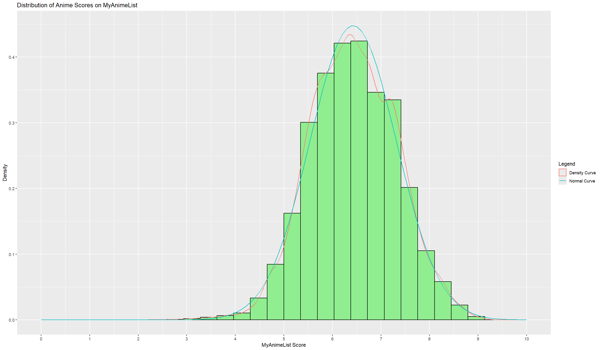
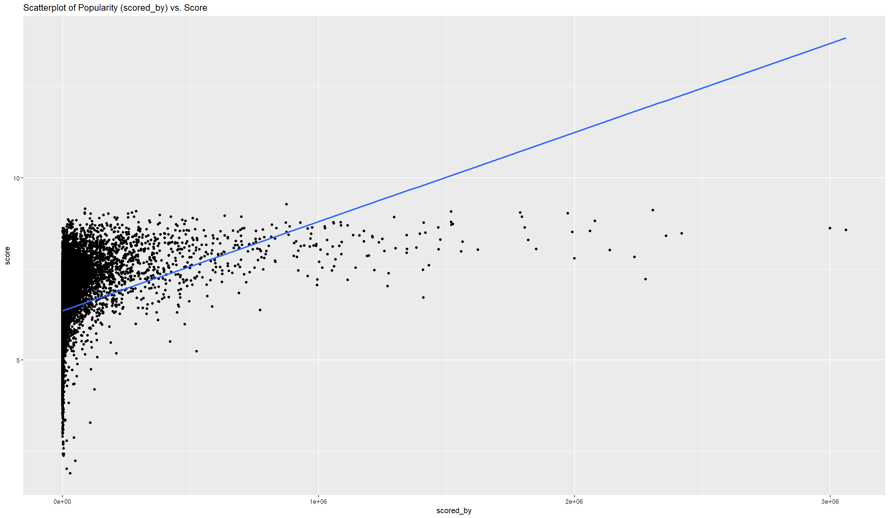
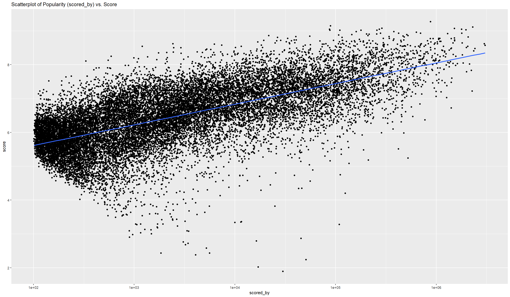
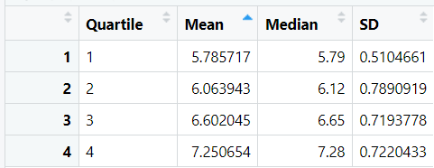
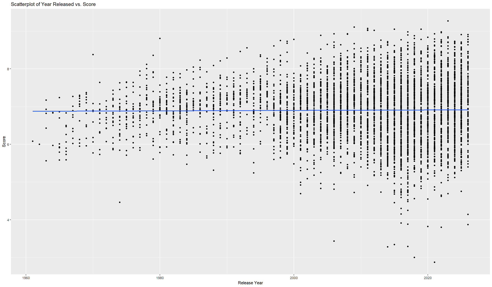
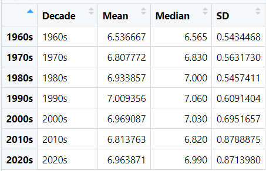
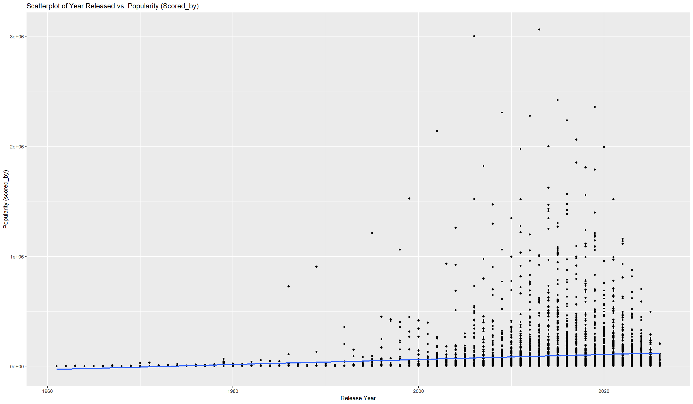
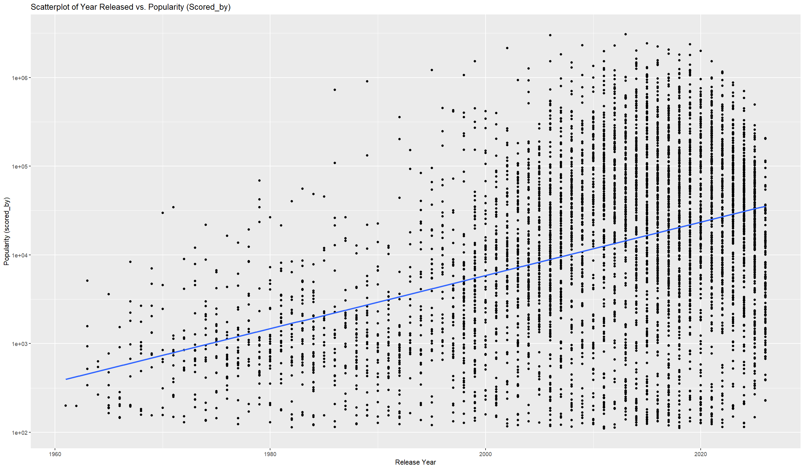
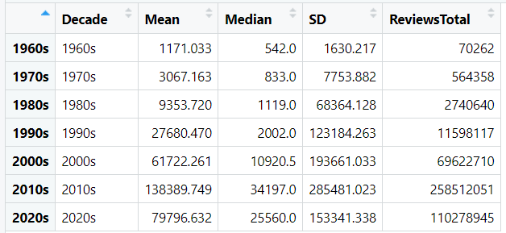

# Anime Rating and Popularity Analysis (MyAnimeList)
## Dataset:
-	Kaggle: https://www.kaggle.com/datasets/patelris/anime-and-manga-dataset-2026 
-	Source: MyAnimeList via Jikan API
## Objective:
I aim to find what variables are associated with a higher score and higher levels of popularity of an anime on MyAnimeList.
## I plan to investigate:
-	What variables are associated with a higher score?
-	What variables are associated with an anime being more popular?
-	How are an anime’s popularity and average score related?
## Note:
-	MyAnimeList captures popularity and ratings based on its user base, which may introduce bias. Therefore, results may not fully generalize to global audiences.
-	For all of the data exploration related to “Popularity,” the “scored_by” variable will be used instead of the “popularity” variable. This is because “popularity” only records the popularity rank of an anime. For the purposes of this project, I want to compare the relative popularity of anime by size, not only rank.
## Removing Variables:
-	“mal_id”, “title_japanese”, and “title_english” were removed because they do not provide any additional information relevant to this project. The title variable can be used to identify each anime. 
-	The “synopsis” variable was removed because it provides a brief description of the anime. As this project does not deal with text sentiment analysis models, the synopsis variable is outside the scope of this project.
-	The “episodes” and “duration” variables were removed because they describe how many episodes an anime has, and how long each episode is. This is outside of the scope of the project.
-	“status” and “airing” describe if a show is currently airing, finished airing, or yet to be aired. Because this project deals with the score of an anime, anime that are yet to be aired will not be usable. Because only about 50 anime are currently airing at once, that is not a large enough sample size to justify investigation.
-	“aired_from”, “aired_to”, and “season” describe when a show aired. Although it would be more specific, and possibly provide more insight, these variables have many more missing values than the “year” variable.  
-	“members” describes how many accounts have an anime on their “list.” This is not useful for determining the popularity of an anime because it includes users who have dropped the show and users who are only planning to watch the show.
-	“favorites” describes how many users favorited an anime. This is not included in the scope of the project.
-	“producers” and “licensors” track sponsors and other corporate entities behind an anime. They are not included in this project in favor of the animation studio, as they have a more direct impact on an anime’s production quality and the resulting audience opinions. 
-	“image_url” is a web link to the cover art of an anime. It does not provide any useful information to this project.
## Removing Rows:
-	Rows where the “score” variable was missing were removed. This is because the target variable is missing, so these rows are unable to be used for this project. 
## Missing Values:
-	Several variables have a notable number of missing values, including the “aired_to”, “season”, “year”, “studios”, “producers”, “licensors”, “genres”, “themes”, and “demographics” columns. As many of these are important for the analysis in this project, they will be kept. The data will be filtered to exclude these missing values only while analyzing the specific variable.  
## Score Distribution

-	The scores follow a roughly normal distribution. 
## Popularity vs. Score
 

### Analysis
There is an evident positive correlation (Correlation Coefficient $\approx 0.336$) between an anime’s score and its popularity (“scored_by”). A linear regression model yields an $R^2 \approx 0.113$, indicating that popularity is responsible for approximately 11.3% of the variance in the score.
* Because the “scored_by” variable has a heavy right-skew, the logarithmic transformation is used to help readability. The right skew is caused by a minority of anime that have millions of reviews logged. Using the logarithmic transformation, the less popular anime’s data points become more readable. 
* Where highly scored anime can be incredibly popular or an obscure indie gem, anime with low scores have the tendency to have a lower popularity. Essentially, anime with a high score may not always be more popular, but an anime with a low score is likely to never become very popular. 
* Dividing the popularity quartiles supports the positive correlation. Each quartile has a higher mean and median than its respective prior quartile. 
* Interestingly, the second quartile has the highest standard deviation. This is clearly represented in the logarithmic scale plot, where the low-middle popularity has a tall vertical range. This is likely the region where niche, highly regarded anime and forgotten, lowly regarded anime are.  
* The positive correlation is driven by a feedback loop. A high score gives an anime critical acclaim, which can act as an organic marketing mechanism. The prestige an anime receives from a high score can help drive an anime into the eyes of the masses, attracting more viewers and, in turn, more reviews. 
## Year vs. Score

### Analysis
There appears to be no statistically significant correlation between an anime’s score and the year it released (Correlation Coefficient$\approx 0.0098$). This lack of statistical significance is supported by the fact that $R^2 \approx 9.696e-5$, meaning that the release year is responsible for less than 0.01% of the variance in score. 
* The lack of a significant correlation is likely because of the quality, and hence user score, of anime across a year will average out, as per the law of large numbers. 
* Notably, all anime released before the year 2000 have a score above 5, with one exception being “Chargeman Ken!”, which was released in 1974. This could suggest some sort of “nostalgia filter,” where older anime are scored more leniently than more modern anime. Another possible explanation is survivor bias, where only reasonably highly-regarded anime would be included on MyAnimeList’s database. 
* When the scores are grouped by decade released, the only major deviation in average score over a decade is in the 1960s, where the average score is ~6.54. Another notable deviation in score is in the 1970s, with an average score of ~6.81. Other than those two decades, the average plateaus around 7 for every other decade. 
* An interesting pattern is that the standard deviation jumps each decade. This may be because the number of anime produced each decade increases, allowing for more outliers to be included in the dataset.
## Year vs. Popularity (“scored_by”)

### Analysis
There is a clear positive correlation between release year and the popularity of an anime ($Correlation Coefficient \approx 0.143$). Linear analysis reveals that $R^2 \approx 0.020$, which suggests that approximately 2% of variance in the popularity can be explained by the release year.
* The logarithmic scale is used to help increase readability, because the peaks of popularity are exponentially increasing. The slope of the fit line is much more clearly upward sloping in the logarithmic scale, which makes it more clear that the correlation is significantly positive. 
* I believe that there is a positive correlation for two reasons. The first reason is that anime as a medium has become more popular in recent years. The second reason is that more people have started using the website MyAnimeList to leave review and/or scores on anime they have watched. 
* When grouped by decade, the average number of reviews on anime doubles each decade from the 1960s to 2010s. The median number of reviews follows a less aggressive exponential growth. 
* There is a large “boom” in total reviews in the 2010s, having ~200,000,000 more total reviews than the 2000s. This could be caused by increased popularity of anime or the MyAnimeList reporting bias previously mentioned. It could also be caused by the fact that many very popular shows released in the 2010s (e.g. *Attack on Titan*, *One Punch Man*, etc.) 

