# Anime Rating and Popularity Analysis (MyAnimeList)
## Dataset:
-	Kaggle: https://www.kaggle.com/datasets/patelris/anime-and-manga-dataset-2026 
-	Source: MyAnimeList via Jikan API
## Objective:
I aim to find what variables are associated with a higher score and higher levels of popularity of an anime on MyAnimeList.
## I plan to investigate:
-	What variables are associated with a higher score?
-	What variables are associated with an anime being more popular?
-	How are an anime’s popularity and average score related?
## Note:
-	MyAnimeList captures popularity and ratings based on its user base, which may introduce bias. Therefore, results may not fully generalize to global audiences.
-	For all of the data exploration related to “Popularity,” the “scored_by” variable will be used instead of the “popularity” variable. This is because “popularity” only records the popularity rank of an anime. For the purposes of this project, I want to compare the relative popularity of anime by size, not only rank.
## Removing Variables:
-	“mal_id”, “title_japanese”, and “title_english” were removed because they do not provide any additional information relevant to this project. The title variable can be used to identify each anime. 
-	The “synopsis” variable was removed because it provides a brief description of the anime. As this project does not deal with text sentiment analysis models, the synopsis variable is outside the scope of this project.
-	The “episodes” and “duration” variables were removed because they describe how many episodes an anime has, and how long each episode is. This is outside of the scope of the project.
-	“status” and “airing” describe if a show is currently airing, finished airing, or yet to be aired. Because this project deals with the score of an anime, anime that are yet to be aired will not be usable. Because only about 50 anime are currently airing at once, that is not a large enough sample size to justify investigation.
-	“aired_from”, “aired_to”, and “season” describe when a show aired. Although it would be more specific, and possibly provide more insight, these variables have many more missing values than the “year” variable.  
-	“members” describes how many accounts have an anime on their “list.” This is not useful for determining the popularity of an anime because it includes users who have dropped the show and users who are only planning to watch the show.
-	“favorites” describes how many users favorited an anime. This is not included in the scope of the project.
-	“producers” and “licensors” track sponsors and other corporate entities behind an anime. They are not included in this project in favor of the animation studio, as they have a more direct impact on an anime’s production quality and the resulting audience opinions. 
-	“image_url” is a web link to the cover art of an anime. It does not provide any useful information to this project.
## Removing Rows:
-	Rows where the “score” variable was missing were removed. This is because the target variable is missing, so these rows are unable to be used for this project. 
## Missing Values:
-	Several variables have a notable number of missing values, including the “aired_to”, “season”, “year”, “studios”, “producers”, “licensors”, “genres”, “themes”, and “demographics” columns. As many of these are important for the analysis in this project, they will be kept. The data will be filtered to exclude these missing values only while analyzing the specific variable.  
## Score Distribution
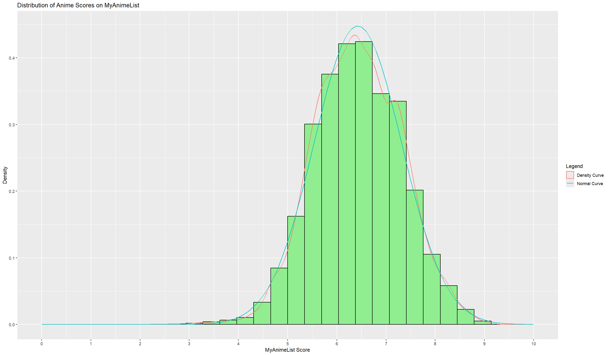
-	The scores follow a roughly normal distribution. 
## Popularity vs. Score
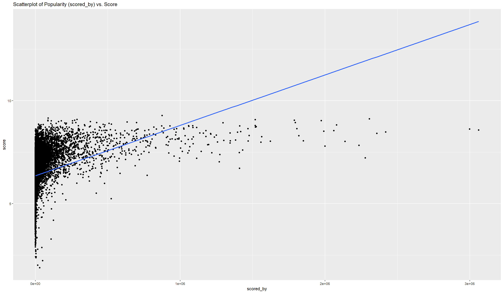 
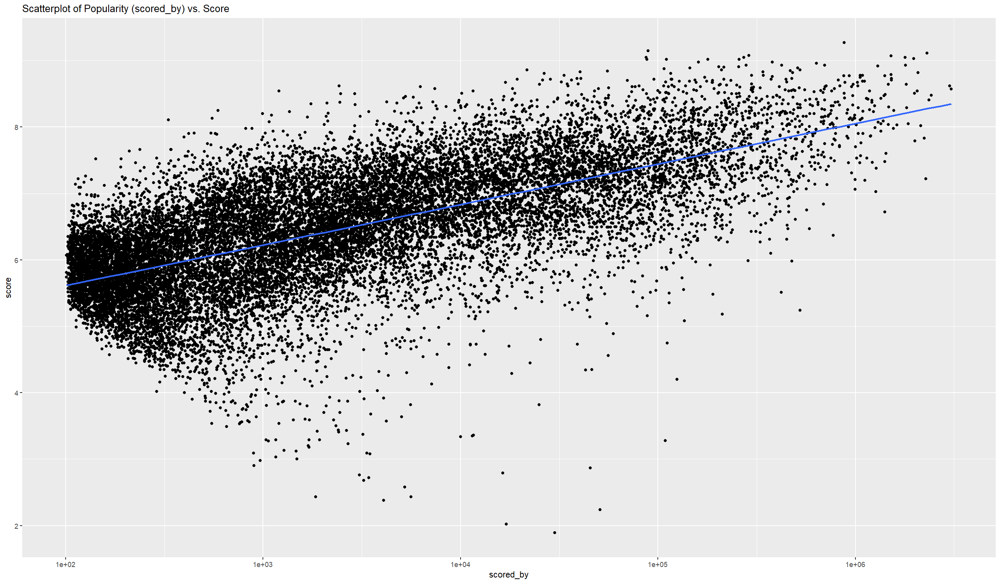
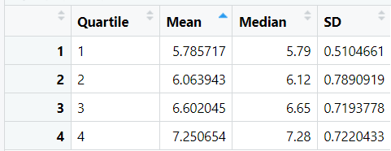
### Analysis
There is an evident positive correlation (Correlation Coefficient$\approx 0.336$) between an anime’s score and its popularity (“scored_by”). A linear regression model yields an $R^2 \approx 0.113$, indicating that popularity is responsible for approximately 11.3% of the variance in the score.
* Because the “scored_by” variable has a heavy right-skew, the logarithmic transformation is used to help readability. The right skew is caused by a minority of anime that have millions of reviews logged. Using the logarithmic transformation, the less popular anime’s data points become more readable. 
* Where highly scored anime can be incredibly popular or an obscure indie gem, anime with low scores have the tendency to have a lower popularity. Essentially, anime with a high score may not always be more popular, but an anime with a low score is likely to never become very popular. 
* Dividing the popularity quartiles supports the positive correlation. Each quartile has a higher mean and median than its respective prior quartile. 
* Interestingly, the second quartile has the highest standard deviation. This is clearly represented in the logarithmic scale plot, where the low-middle popularity has a tall vertical range. This is likely the region where niche, highly regarded anime and forgotten, lowly regarded anime are.  
* The positive correlation is driven by a feedback loop. A high score gives an anime critical acclaim, which can act as an organic marketing mechanism. The prestige an anime receives from a high score can help drive an anime into the eyes of the masses, attracting more viewers and, in turn, more reviews. 
## Year vs. Score
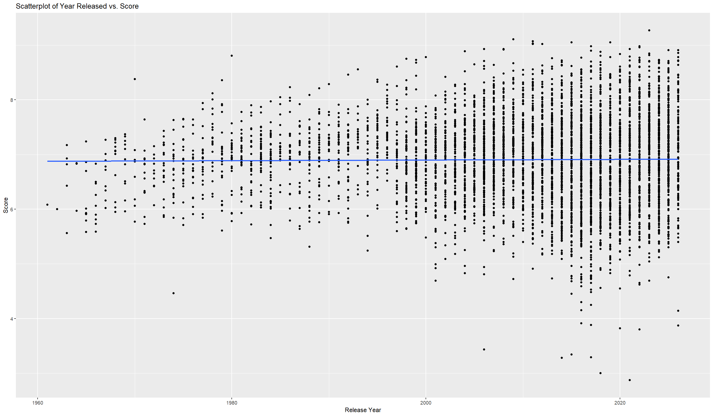
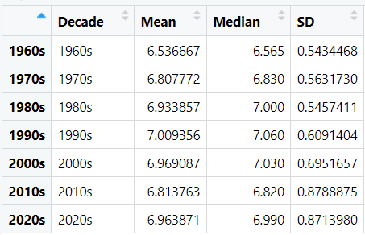
### Analysis
There appears to be no statistically significant correlation between an anime’s score and the year it released (Correlation Coefficient$\approx 0.0098$). This lack of statistical significance is supported by the fact that $R^2 \approx 9.696e-5$, meaning that the release year is responsible for less than 0.01% of the variance in score. 
* The lack of a significant correlation is likely because of the quality, and hence user score, of anime across a year will average out, as per the law of large numbers. 
* Notably, all anime released before the year 2000 have a score above 5, with one exception being “Chargeman Ken!”, which was released in 1974. This could suggest some sort of “nostalgia filter,” where older anime are scored more leniently than more modern anime. Another possible explanation is survivor bias, where only reasonably highly-regarded anime would be included on MyAnimeList’s database. 
* When the scores are grouped by decade released, the only major deviation in average score over a decade is in the 1960s, where the average score is ~6.54. Another notable deviation in score is in the 1970s, with an average score of ~6.81. Other than those two decades, the average plateaus around 7 for every other decade. 
* An interesting pattern is that the standard deviation jumps each decade. This may be because the number of anime produced each decade increases, allowing for more outliers to be included in the dataset.
## Year vs. Popularity (“scored_by”)
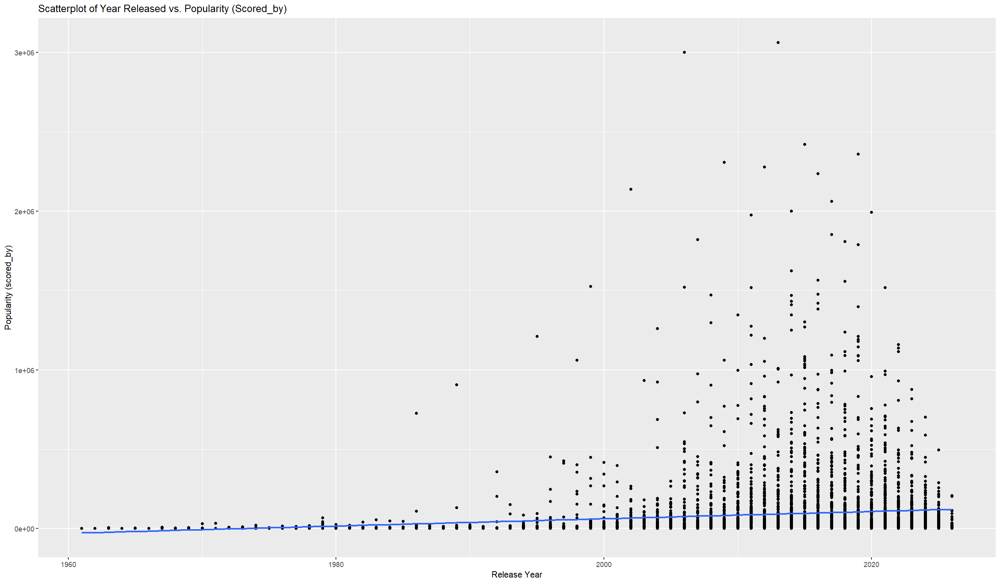
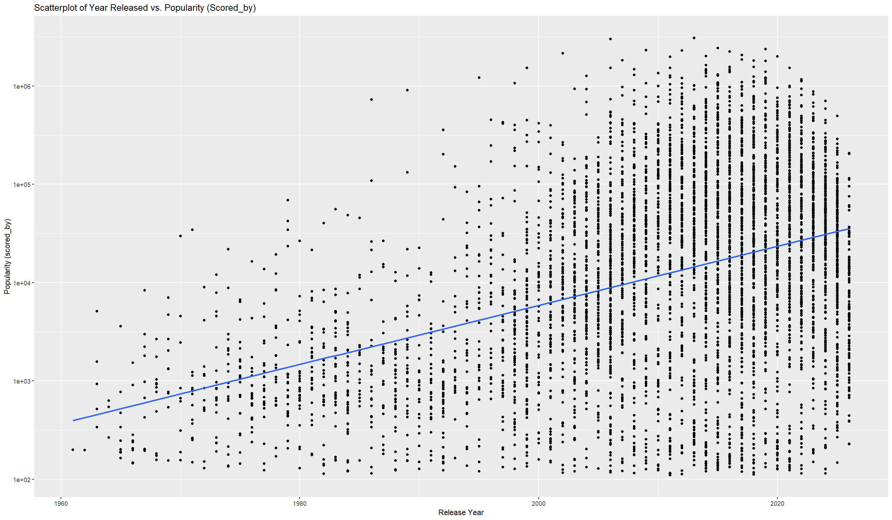
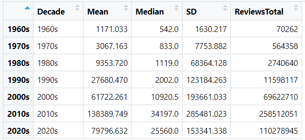
### Analysis
There is a clear positive correlation between release year and the popularity of an anime ($Correlation Value \approx 0.143$). Linear analysis reveals that $R^2 \approx 0.020$, which suggests that approximately 2% of variance in the popularity can be explained by the release year.
* The logarithmic scale is used to help increase readability, because the peaks of popularity are exponentially increasing. The slope of the fit line is much more clearly upward sloping in the logarithmic scale, which makes it more clear that the correlation is significantly positive. 
* I believe that there is a positive correlation for two reasons. The first reason is that anime as a medium has become more popular in recent years. The second reason is that more people have started using the website MyAnimeList to leave review and/or scores on anime they have watched. 
* When grouped by decade, the average number of reviews on anime doubles each decade from the 1960s to 2010s. The median number of reviews follows a less aggressive exponential growth. 
* There is a large “boom” in total reviews in the 2010s, having ~200,000,000 more total reviews than the 2000s. This could be caused by increased popularity of anime or the MyAnimeList reporting bias previously mentioned. It could also be caused by the fact that many very popular shows released in the 2010s (e.g. *Attack on Titan*, *One Punch Man*, etc.) 
## Genre vs. Score
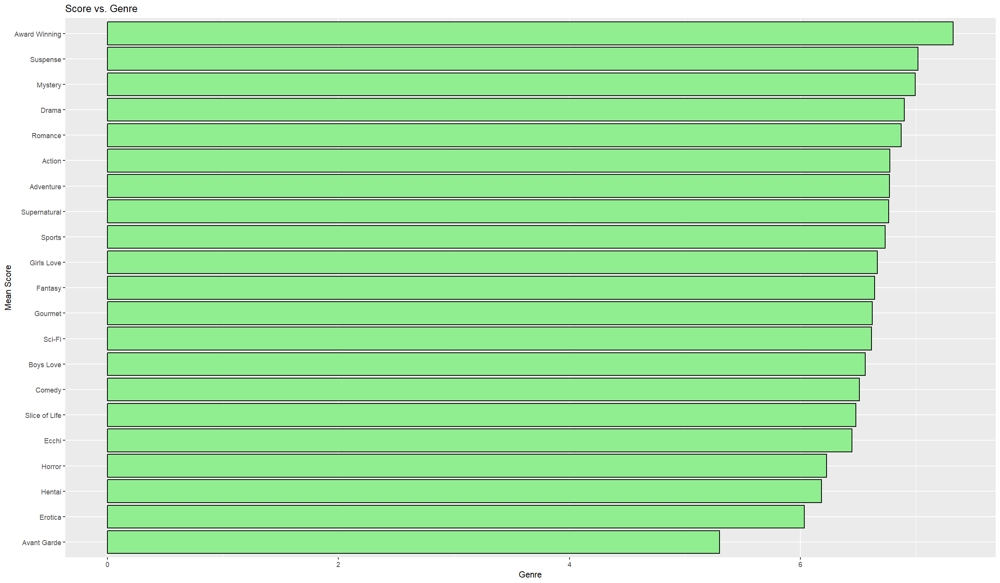
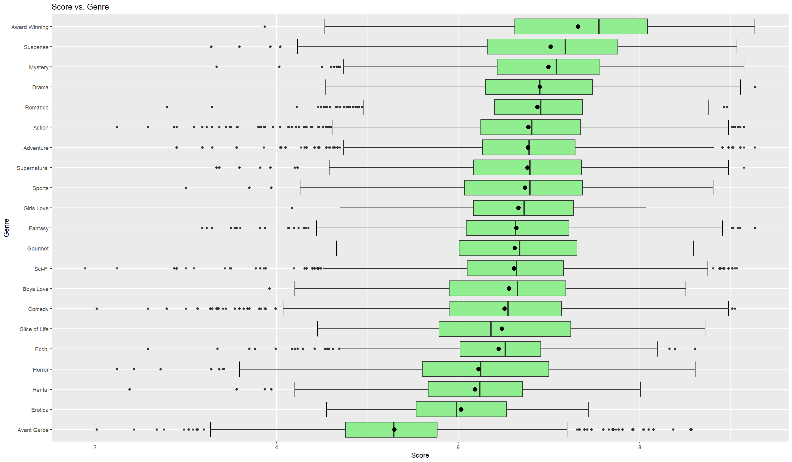
###Analysis
There are certain genres that have a higher or lower average score than the rest. However, in general, the majority of genres have an average score between 6 and 7. 
* The highest average score genre is “award_winning” (~7.3). This is expected because an anime that receives an award is more likely to be higher quality in some regard than an anime that does not receive an award. 
* The next four highest scoring genres on average are Suspense, Mystery, Drama, and Romance, which all have an average score above 6.87. There are a few possible explanations for these genres’ higher user ratings:
	* Suspense, Drama, and Mystery are typically associated with interesting characters or plot. 
	* Romance is associated with relatable characters or an emotional story.
	* All four of these genres are designed to create an impact, either emotionally or thematically.
* The lowest scoring genre on average is “avant_garde” (~5.3). Since avant-garde anime by nature will be adventurous in art style or themes, many audiences may be less receptive to these anime. 
	* Notably, some anime that could be considered “avant-garde” are not labeled as such on MyAnimeList (e.g. the Madoka Magica and the Monogatari series). Notably, avant-garde can be difficult to define. 
* The next three lowest scoring genres on average are Erotica, Hentai, and Horror, each having an average score below 6.25.
	* Erotica and Hentai are explicit in nature, and their main purpose is not to tell a compelling story.
	* Horror can be difficult to pull off in anime form. It is difficult to properly scare all audiences; what scares some audiences may not scare others. 
* The lowest standard deviations are Erotica, Hentai, Ecchi, and Romance, all having a standard deviation below 0.75. 
	* In this case, a low standard deviation suggests that shows of these genres are similarly scored. For the explicit genres of Erotica, Hentai, and Ecchi, this is possibly because these anime are produced for a specific purpose, which could result in less variance. 
	* Similarly, Romance anime’s low standard deviation may be because romance anime are notorious for falling into common tropes. This will result in many romance anime being similar to each other, resulting in a more consistent audience reception. 
## Genre vs. Popularity (“scored_by”)
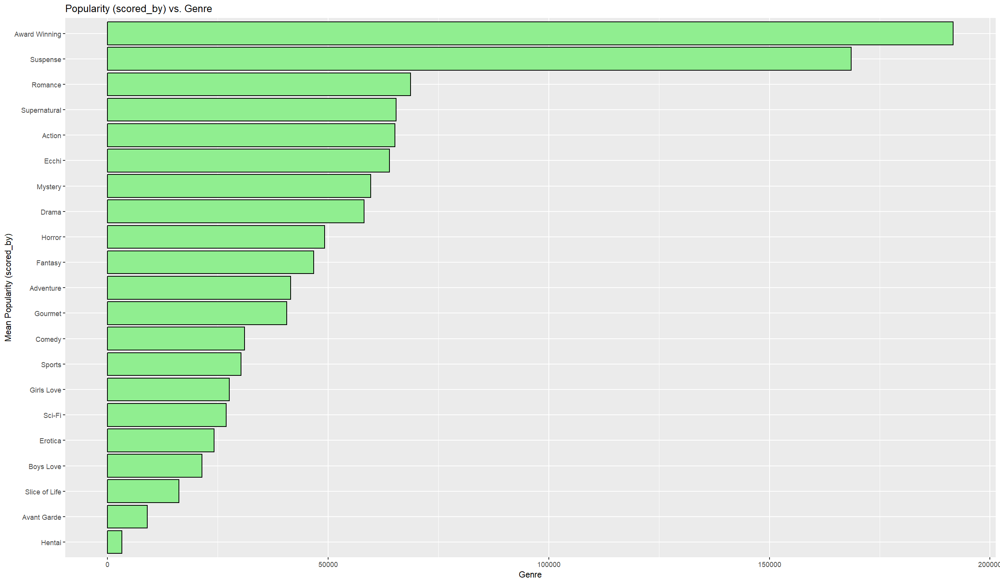
### Analysis
By visually observing the bar graph, there appear to be notable differences between the popularity of anime of different genres, with some genres having substantially higher or lower level of popularity than others. 
* The genre with the highest level of popularity is “award_winning,” with an average over 190,000 reviews. Notably, “award_winning” is also the genre with the highest standard deviation of over 413,000. 
	* A possible explanation for the high popularity may be that an anime winning an award may attract new viewers to that anime. Conversely, an anime that is receiving lots of attention could be more likely to receive an award as a result of its popularity. 
	* The high standard deviation may be because, although some award-winning anime will be very popular anime that receive high-prestige awards, some award-winning anime may be niche anime winning niche awards. One possible example of this is an indie film winning an award at a film festival. 
* The genre with the second highest average number of reviews is Suspense, with an average over 170,000 reviews per anime. Interestingly, Suspense has the second highest standard deviation of 372,000.
	* The high average number of reviews may be because a large number of very popular anime (e.g. the *Attack on Titan* series, *Death Note*, *Tokyo Ghoul*, and *Steins;Gate*, etc.) are labeled as Suspense on MyAnimeList. 
	* These outliers may also contribute to the high standard deviation. Because so many massive outliers exist in the suspense genre, the standard deviation can be expected to be very high as well.
* The lowest average popularity is Hentai, with just over 3,000 reviews on average. This could be because Hentai is not as popular as anime that are not explicit. This may be compounded by reporting bias; individuals who watch this explicit content may not record it on a website like MyAnimeList.
* One notable genre is “Slice of Life,” which has an average ~16,000 reviews, but a median 975 reviews. This heavy right skew is likely the result of a combination of a small number of slice of life anime and a handful of massively popular anime compared to a majority of unpopular anime.
	* Something that may be compounding this effect is tagging bias, where many character driven “comfort shows,” that could be considered slice of life, are only tagged as Romance or Drama on MyAnimeList (e.g. *The Fragrant Flower Blooms with Dignity*).
## Type vs. Score
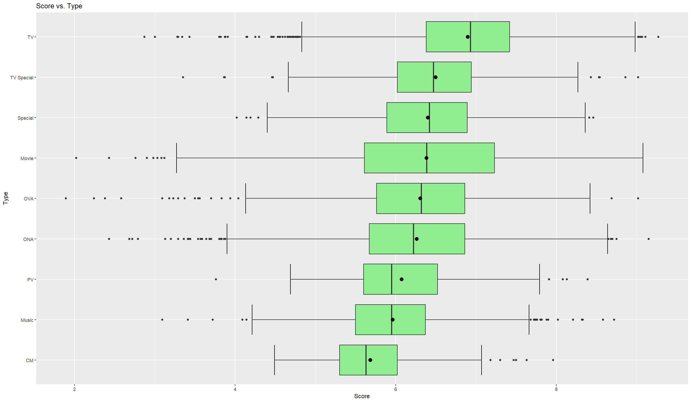 
### Analysis
There appear to be some minor variations in average user score relative to the anime type.
* The only “Type” that is notably higher than the others is TV. It has an average score of ~6.9. This is ~0.4 larger than the second highest average, TV Special. This suggests that TV anime typically receive the highest user scores.
* The lowest Type by average is CM, which is commercial. CM is primarily just promotional material, so it is expected that it would have lower scores than a full anime.
* The next two lowest types are Music and PV (Promotional Video). 
* Music is mainly comprised of music videos or opening or closing theme songs that were released independently of the main show. Similar to commercials, the shorter length and more limited scope may contribute to the lower scores.
* PV is similar to CM in that they are both promotion for a full-scale anime, but it contains more content. PV often function as a trailer, where a CM is a 30-second commercial. It makes sense that PV has a higher score than CM, but a lower score than full anime.
## Type vs. Popularity (“scored_by”)
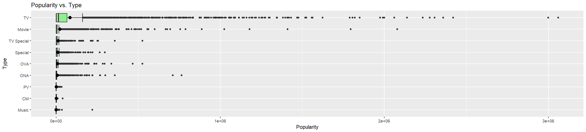
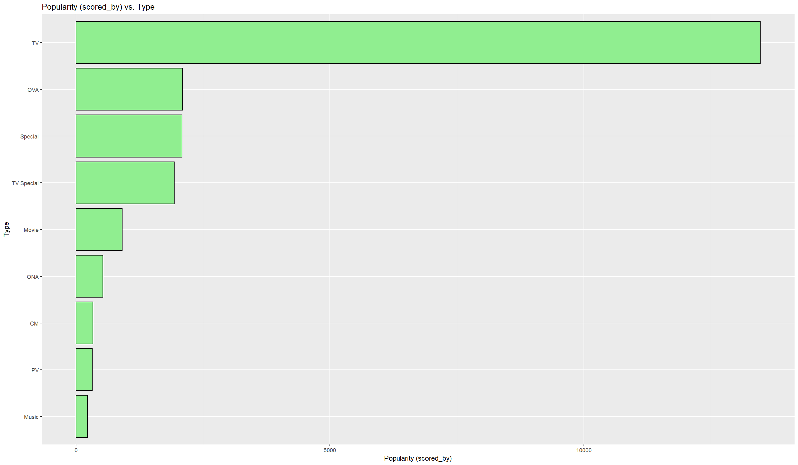
### Analysis
All of the Types of anime demonstrate a heavy right-skew. Additionally, there seem to be notable differences in popularity based on Type.
* The most popular Type by far is TV anime. TV anime have a median number of reviews of over 13,000. This is notably higher than the second highest median, OVA, which has a median of about 2,100  reviews.
	* A possible explanation could be that TV anime is the most “common” form of anime. It is both the most produced type of anime, according to MyAnimeList’s database, and also is the most widely accessible type of anime thanks to the rising popularity of streaming services.  
* The second-highest format by median number of reviews is OVA (Original Video Animation), with a median of 2103 reviews. Historically, OVAs were independent, standalone productions. Currently, OVAs are most commonly child productions to already existing intellectual properties (e.g. *Kaguya-sama: Love is War*, *Attack on Titan*, etc.). These will attract the already existing fans of the series to the OVAs, possibly resulting in a higher median.
* Comparatively, Movies have the second highest mean popularity (~21,000), but a very low median of 914 reviews. This is because movies will not always have the “safety net” that OVAs do. Many movies will remain in obscurity, never reaching global audiences. However, some independent anime movies can become very popular globally. Two of the twenty most popular anime on MyAnimeList are movies, *Your Name* and *A Silent Voice*.
* The heavy right-skew is seen in that the mean is greater than the median for all types of anime. One possible explanation is that some anime will be massive hits, but the majority of anime are niche or obscure. 
 
